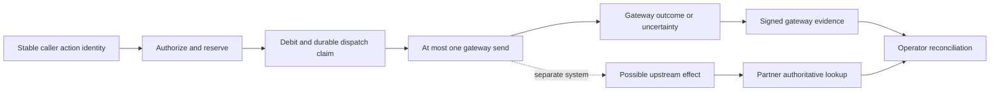

# Deep Market Lab — Agent Middleware API

Decision date: **2026-08-31**. Evaluated the current dirty working tree over
`46d7310a3b771542dfb1fe874b5cff9d6bf137b2`, with source snapshots and concurrent
engineering changes explicitly distinguished. This is a completed research
wave and decision handoff, not a production approval or completed customer
validation program.

**Verdict: MODIFY the commercial hypothesis, CONTINUE bounded customer
validation, and PAUSE new core expansion. Local technical gates G0–G5 are
ACCEPTED on frozen source manifest
`f0c7d4236ffc785ca98e002bc4ea3f1759c9d0cc30e972798f37c2a021b5c289`;
production, ingress, and partner gate G6 remain open.**

At the pre-integration validation cutoff, concurrent work had changed 18 paths
in that accepted manifest. The frozen packet remains valid for its exact bytes,
but that captured 18-path comparison is historical; any later checkout requires
its own source binding and affected-gate reruns before use in a pilot.

There is a substantial, testable gateway mechanism here. There is not yet
verified evidence in the reviewed material that a customer needs to buy it.
The most valuable next work is to verify the required staging ingress
restriction and compare this boundary against one partner's strongest existing
controls on a real staging mutation. Another broad agent platform, feature
wave, or internal proof campaign would not answer the buying question.

## What changed the judgment

| Question | Finding | Confidence and evidence |
|---|---|---|
| Does the implementation exist beyond a demo? | Yes: durable identity, allowance/debit, one-shot dispatch, uncertainty, and linked evidence are implemented on the supported MCP path. | Strong local evidence, conditional guarantee; [technical audit](technical.md), [mechanism review](mechanism.md). |
| Is the current technical qualification complete? | **Complete only for the frozen local snapshot.** The accepted source passed the default-pool 20-call/20-replay case and the actual singleton application-pool suite. The pre-integration audit later found 18 accepted paths drifted; that historical count does not qualify any subsequent tree. Production and partner readiness remain unaccepted. | [Program control](../../aegis/work/2026-08-31-program-control/README.md), [command manifest](/tmp/amw-launch-20260831/logs/acceptance-command-manifest.json), [independent review](/tmp/amw-launch-20260831/logs/acceptance-independent-review.json), [acceptance update](engineering-acceptance-update.md). |
| Does one gateway dispatch prove one business effect? | No. Zero delivery, late effects, multiple effects inside one call, and effect-then-error all require separate reasoning. | High confidence in boundary reasoning; [340-state explanatory model](mechanism-model-results.json), not implementation proof. |
| Is the primitive combination uncontested? | No demonstrated uniqueness or moat. Native idempotency, durable workflows, stateful gateways and owned ledgers are credible substitutes. | Current primary documentation, not vendor runtime benchmarks; [seven-way comparison](market.md). |
| Is customer demand established? | No verified partner-owned pilot or commercial commitment. Program control reports a provisional lead and offered call from a private task, but the inbound message and current availability were not independently verified. | No claim of zero leads or customers; [customer audit](customer-product.md), [next-cycle evidence boundary](next-cycle.md#evidence-boundary). |
| Are business margins established? | No. Configured credits and debit-based reports are not collected revenue or fully loaded delivery cost. | Inspected code plus explicit scenario arithmetic; [economics](economics.md). |

The review does **not** recommend killing the repository. It also does not
justify accelerating a company or a release. A useful mechanism can be worth
maintaining without supporting a standalone business; the partner comparison
and commercial decision distinguish those outcomes.

## Quantum Management delta

The strict cutoff is `2026-08-31T08:27:37.808Z`; work initiated by the earlier
program and completed later is described as completed **during** Quantum
Management. [Baseline and attribution evidence](quantum-baseline.md).

| Requested delta | Objective result | Completion evidence |
|---|---|---|
| What shipped | Six bounded correctness/reliability groups were locally integrated across 22 paths and captured in frozen manifest `f0c7d423…`. Nothing was committed, pushed, deployed, or shipped to a customer. | [Path and behavior delta](shipped-delta.md#what-was-integrated), [application record](/tmp/amw-launch-20260831/logs/acceptance-application.json) |
| Tests now passing | On the frozen source: all ten commands exited 0, including 65 default-pool regressions with 20 calls/20 replays and 36 actual singleton-pool cases. Baseline Ruff, mypy, trust, PG8 and PG18 passes are excluded from the delta. Counts overlap. | [Accepted lanes](shipped-delta.md#tests-that-passed-on-the-frozen-accepted-source), [pre-cutoff evidence](quantum-baseline.md#what-was-already-true-before-quantum-management) |
| Hypotheses falsified | Passing earlier suites was insufficient for the 20-call workload; pool inflation was unnecessary; gateway dispatch/receipt does not prove one business effect; an empty lookup does not make replacement safe; more internal management/research is not the current decision bottleneck. | [Hypothesis audit](hypothesis-delta.md) |
| External evidence obtained | Public substitute documentation and price references; a private task reports that Boardy accepted the introduction criteria. No verified partner-run comparison, buyer commitment, payment, or commercial decision was obtained. | [External-evidence table](hypothesis-delta.md#external-evidence-actually-obtained), [program intake](../../aegis/work/2026-08-31-program-control/README.md#continued-management) |
| Blockers remaining | At the pre-integration validation cutoff, the checkout differed from the accepted manifest in 18 paths; that historical count cannot qualify a later tree. Ingress 413 behavior is unverified; G6 lacks a committed partner/tool/engineer/date and authoritative effect semantics; commercial evidence is absent. | [Acceptance update](engineering-acceptance-update.md#what-remains-open), [packet entry gate](partner-comparison-packet.md#entry-gate) |
| Duplicated work eliminated | One registry and one runtime owner replaced competing managers; one existing eight-specialist pod was reused; eight overlapping workers stopped; two replacement audits were cancelled. | [Duplication audit](kill-list.md#objective-delta-duplication-already-eliminated) |
| Killed or frozen now | The four-hour no-delta heartbeat is paused. Standing internal pods, further desk research, active use of superseded roadmaps, broad partner-route exposure, and new core work remain frozen. | [Kill decisions and receipt](kill-list.md#what-to-kill-now-what-to-preserve) |
| Highest-leverage next action | The founder converts provisional lead `PW-20260831-01` into one dated partner-owned A/B staging experiment and written commercial decision; only then does one engineer bind the exact candidate and verify ingress before exposure. | [Next-cycle contract](next-cycle.md), [fillable packet](partner-comparison-packet.md) |

## Technical truth and its limits

For one accepted, stable logical-action identity on the governed path, the
architecture aims to authorize/reserve configured consumption, debit once,
claim at most one gateway dispatch, retain uncertain delivery, and preserve
linked evidence. This depends on continuous durable database history, the
caller preserving the identity, no bypass path, and trusted operator/key
control. It does not infer that two different keys mean the same intended
business action. Changing only a permit under an existing identity conflicts
with payload binding; it does not create another accepted identity.

The important boundary is between the gateway's observation and the upstream's
business truth. An error/refund can coexist with an applied mutation. A signed
success can report an upstream acceptance without proving eventual completion.
A point-in-time empty lookup does not make a new-key replacement safe if an
old operation can still complete. Upstream idempotency needs the correct scope,
retention and atomicity; eventual delivery is additionally needed to promise
an actual completed effect. The current design intentionally trades automatic
progress for conservative non-redispatch after ambiguity.

The independently corrected finite model examined **340 states and 1,526
transitions**. It explains those limits under explicit premises; it does not
verify SQL, cryptography, every process schedule or upstream behavior.
[Independent review](independent-review.md) caught an overpermissive lost-commit-
ack recovery transition and required its correction before acceptance.

The final engineering acceptance reports **1,688 passed / 65 skipped /
6 deselected** in the full suite, with separate **65 default-pool PostgreSQL
regressions, 36 actual singleton-application-pool cases, 9 crash cases,
18 concurrency cases, 5 datetime/trust cases, and 6 posture cases passed**.
Ruff, mypy and the release gate also passed. These overlapping counts must not
be summed. The default-pool suite includes 20 successful calls and 20 stable
replays; the singleton suite used pool size one with zero overflow and completed
cleanup.

The earlier rapid-invoke and baseline comparisons both failed from pool
starvation. Those failures remain historical evidence of the reproduced defect.
The accepted fix reused caller sessions through signing-key verification and
passed without pool inflation or weakened assertions. A 10 MiB accepted-payload
observation still calls `pytest.skip`; it is not a passing ingress-security
assertion. Browser coverage remains optional and unexecuted.

This research reran its pure models and a source-hash audit at the report
cutoff, not the application suites owned by the engineering program. All 572
whitelisted files
matched the checkout and four tested roots when
[technical-evidence.json](technical-evidence.json) was generated. A later fresh
pre-integration check found 18 changed accepted paths and zero missing files.
That count is a captured validation result, not a live checkout status. The accepted
application record says the index was unchanged at its cutoff; later authorized
work also changed the index. Neither statement is a current-tree qualification.
Production and partner acceptance remain with program control.

## The market conclusion

The relevant alternative is the customer's complete current solution, not a
generic chatbot with unsafe retry defaults. AWS now documents session-aware
policy, including approval and cumulative-budget examples; its session limits
also have explicit caveats. Temporal documents at-most-once normal Activities
with a single attempt. Stripe documents indeterminate outcomes and later
reconciliation. Those facts narrow any differentiation to measured value in
maintaining the combined authority, consumption and evidence boundary.
[AWS](https://docs.aws.amazon.com/bedrock-agentcore/latest/devguide/policy-temporal-authoring.html),
[Temporal](https://temporal.io/blog/idempotency-and-durable-execution),
[Stripe](https://docs.stripe.com/error-low-level).

The stronger commercial hypothesis is:

> A team with one important autonomous write blocked by fragmented authority,
> retry and reconciliation controls will pay for a maintained gateway boundary
> if it clears that restriction more cheaply and reliably than their best
> existing stack.

This is **a hypothesis**. The present managed single-tenant, public-HTTPS,
synthetic/redacted pilot excludes many enterprise deployment requirements.
High consequence does not imply willingness to place sensitive data or a new
availability dependency in the path. Platform/security bundling can defeat a
specialist without replicating every feature. No TAM, adoption count, market
share, retention rate or patent defensibility was established.

The best initial design remains the current one-tool API path with a clear
operator worksheet: show stable identity, gateway state, configured charge,
remaining uncertainty and a separate authoritative effect reference. Use the
existing verifier and manual observations before building a dashboard. The
[product comparison](customer-product.md) considers an embedded/library form
and an evidence/reconciliation service as alternatives, but neither is approved
for implementation without an actual prospect's blocker.

## Economics and scale

The [reproducible model](economics_model.py) has four illustrative conditions
across 10–1,000,000 monthly actions, plus contract, tenant and uncertainty
sensitivities. **These are not measured costs, throughput, probabilities or
revenue forecasts.** It uses public resource rates only as references and
explicitly marks Enterprise/Sentinel contracts, resource use and human effort
as unknown inputs.

At one tenant and 10,000 monthly actions, the illustrative base gives **$2,183
monthly economic break-even** and **$2,933 first-month economic cost**. The
assumed $1,000 Enterprise commitment materially determines those results.
The $1,145 external nonlabor proxy excludes all labor, including hires an
overloaded founder would need; it is not total cash requirements or runway.
The independent reviewer required this distinction.

At ten separately operated tenants, a hypothetical shared minimum yields
$780/tenant; a separate $1,000 minimum for each yields $1,680/tenant with all
other assumptions unchanged. Neither allocation is a verified contract. At
larger/adverse workloads, manual uncertainty handling and support dominate the
modeled CPU cost. A million actions does not establish capacity for a million
users, and cheap per-action compute cannot compensate for unlimited human
reconciliation.

A **$2,000 service fee for a capped pilot, with approved infrastructure costs
separate**, is one proposed willingness-to-pay test, not a market price or an
offer already sent. Obtain actual costs first and agree an explicit time/scope
cap. A proposed 30-day service term does not restart the existing September 11
validation deadline or count as a completed pilot. No new pricing/billing
implementation is needed to quote or invoice one pilot manually.

## Decisive experiment and stop rules

Use one partner-owned agent, one consequential retry-sensitive staging
mutation, and one committed engineer. Compare:

- **A:** the partner's best existing gateway/workflow/ledger plus upstream
  idempotency and authoritative effect lookup.
- **B:** the same tool and native protections with this supported gateway.

The partner runs effect-then-response-loss, exact replay, changed-payload
conflict, configured authority exhaustion, separate effect reconciliation and
offline verification. Record preparation and integration hours, added latency,
operator/partner minutes, failure handling and whether the partner will retain
and pay for the boundary. Agree acceptable overhead before the test. Multiple
safe upstream requests with one idempotent effect can pass the business
baseline; competitors need not emit this repo's receipt format to be adequate.
See [the complete comparison](market.md#the-killer-comparison-experiment).

Do not expose the pilot until the operator and partner engineer verify a
dedicated restricted staging deployment and a suitable pre-application
request-size limit with an actual 413 rejection. The bounded local reliability
gate is cleared. As of this review, no partner access, new outreach, purchase,
deployment or external mutation was performed.

By **2026-09-11**, use the sprint's existing decision rules:

- **Continue narrow validation:** partner-owned technical acceptance plus a
  paid pilot or credible written buyer/budget/date commitment.
- **Modify/pivot only on evidence:** repeated pain exists but the supported
  primitive or deployment boundary is wrong; name the prospect/blocker before
  approving the smallest change.
- **Pause core expansion:** existing controls suffice, the inline dependency
  is unacceptable, or 10 qualified interviews produce no staging commitment.
  Incomplete research is an incomplete result, not proof of zero demand.

After August 31 there are 11 calendar dates through September 11. Actual
interview/pilot completion counts remain unknown; do not treat the sprint's
targets as observed conversion rates. The first next action is to retrieve a
sanitized prospect evidence index, not create another roadmap.

## What stays frozen and what was deliberately not simulated

Keep AWI/browser, media, IoT, oracle, broad agent governance, payment rails,
new protocols, standards campaigns and multi-tenant orchestration frozen.
Remove obsolete capability/deployment implications from active messaging when
its existing owner next edits it; preserve history and security checks. No
files or product capabilities were deleted by this research.

No Monte Carlo loss distribution, ruin probability, user-growth curve or
simulated interview count was manufactured. There are no defensible inputs
for those estimates. Deterministic sensitivities and explicit counterexamples
give more decision value. Trading bull/bear/liquidity models from the generic
document do not match this product; the relevant shocks are incumbent
bundling, unacceptable deployment, unresolvable effects, high operator load,
state/key compromise and inability to reach a buyer. Regulatory/patent/legal
clearance and independent human usability research were not performed.

Further desk-research waves stop here unless new evidence changes a decision.
The bounded local engineering run is closed; reopen it only for a demonstrated
defect or concrete pilot qualification need. The missing business inputs require
actual partner participation. No new automation or background-work promise was
created.

## Evidence package and verification

| Artifact | Purpose |
|---|---|
| [quantum-baseline.md](quantum-baseline.md) | Strict management cutoff, source baseline and pre-existing evidence |
| [shipped-delta.md](shipped-delta.md) | Objective source/test/external-evidence delta since that cutoff |
| [hypothesis-delta.md](hypothesis-delta.md) | Falsified, locally supported and externally untested hypotheses |
| [kill-list.md](kill-list.md) | Eliminated duplication, current kill/freeze decisions and reallocation |
| [technical.md](technical.md) | Source-bound runtime evidence, historical failure, accepted local resolution, scope and remaining harness gaps |
| [mechanism.md](mechanism.md) | Conditional reasoning, counterexamples and contract corrections |
| [market.md](market.md) | Seven current substitutes, primary sources and a fair comparison |
| [customer-product.md](customer-product.md) | Customer-evidence audit, product/UX alternatives and distribution gates |
| [economics.md](economics.md) | Explicit assumptions, scale sensitivities and price experiment |
| [decision-ledger.md](decision-ledger.md) | 18 assumptions, eight claims, next ten actions and stopping rules |
| [independent-review.md](independent-review.md) | Adversarial judgment, model corrections and unresolved disagreement |
| [engineering-acceptance-update.md](engineering-acceptance-update.md) | Dated reconciliation from the historical reliability hold to local acceptance |
| [partner-comparison-packet.md](partner-comparison-packet.md) | Fillable one-partner A/B record, entry gates and missing inputs |
| [next-cycle.md](next-cycle.md) | Single next-cycle action, dates, owners, exit criteria and stop rules |
| [validation.json](validation.json) | Reproduction, syntax/lint/link checks and result validation |

Reproduce the pure models with `python3` on `economics_model.py` and
`mechanism_model.py` in this directory. `verify_evidence.py` additionally needs
the retained `/tmp/amw-launch-20260831` evidence directory; it reads no database
or credential files. Temporary launch artifacts are not guaranteed permanent
retention. The current research JSON records their digests and observations;
the existing owner controls final archival provenance.

- **Files changed:** this dated research directory only by this task and its
  five bounded research/review agents; concurrent application changes belong
  to the existing engineering program.
- **What changed:** a source-grounded verdict, fresh market research, customer
  evidence audit, reproducible explanatory models, independent critique and
  prioritized experiments; no application, API, schema, dependency or deployment
  changes by this task.
- **Tests run:** pure research models, source/log audit and artifact validation;
  application executions above belong to the existing engineering team.
- **What passed:** bounded model/arithmetic checks; all 572 listed files still
  match each frozen tested root; the engineering packet accepted all ten local
  commands on that frozen source. At the pre-integration validation cutoff, the
  then-current checkout matched 554/572; that historical comparison does not
  qualify any subsequent checkout.
- **What was not tested:** actual partner demand/payment, live vendor behavior,
  production, throughput, legal clearance and human usability. The earlier
  rapid-invoke failure remains historical evidence; it is no longer a current
  hold.
- **Remaining risks:** conditional effect/identity guarantees, operator/key
  continuity, unverified pre-application request-size rejection, restore/load/HA
  limits, unmeasured total cost and no verified commercial pull.
- **Recommended next step:** the founder/customer owner verifies the provisional
  lead, supplies the partner/tool/engineer/date inputs, qualifies the A/B
  comparison, and verifies staging ingress controls before September 11.
